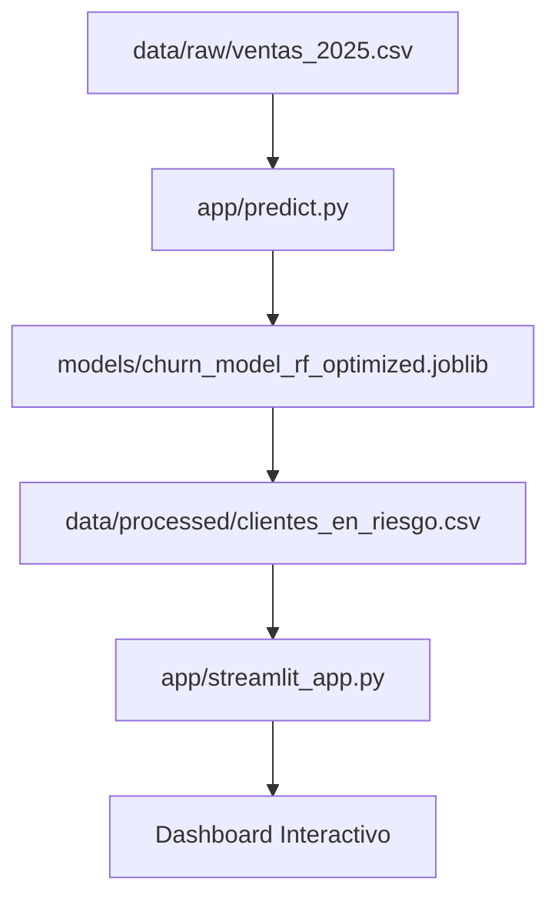

# 📖 Documentación del Proyecto TelecomX

Bienvenido a la documentación centralizada del sistema de predicción de Churn de **TelecomX**. Este repositorio contiene todas las herramientas necesarias para transformar datos brutos en decisiones de retención de clientes.

## 🗺️ Mapa de Documentación

### 1. [Instalación y Configuración](INSTALL.md)
*Cómo preparar tu entorno local, instalar dependencias y verificar la integridad de los modelos.*

### 2. [Guía de Uso del Pipeline](USAGE.md)
*Instrucciones para correr el script de inferencia `predict.py` y lanzar la aplicación Streamlit.*

### 3. [Reporte Ejecutivo de Resultados](REPORTE_EJECUTIVO.md)
*Resumen de hallazgos de negocio, métricas finales del modelo (ROC-AUC, Recall) e insights estratégicos.*

---

## 🏗️ Arquitectura del Sistema

## 👥 Soporte y Mantenimiento
Para dudas sobre la lógica del modelo o el preprocesamiento de datos, consulta el notebook de desarrollo en `ml_project/notebooks/TelecomX.ipynb`.
